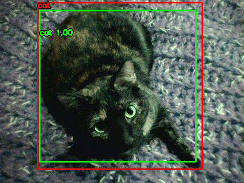
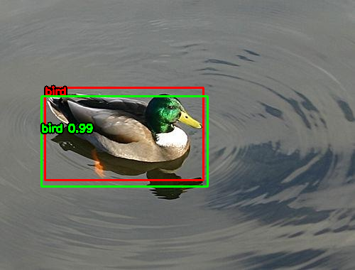
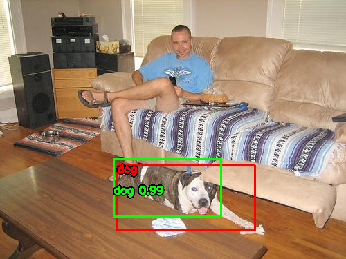
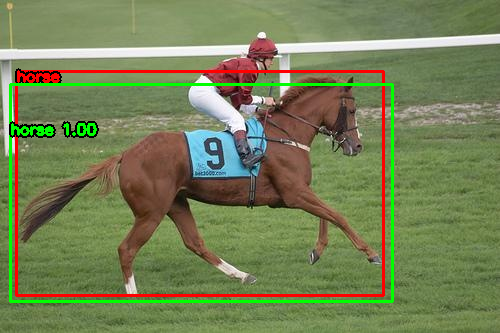
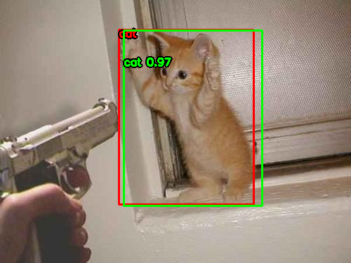
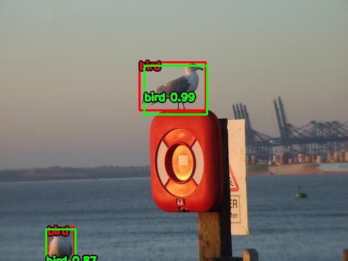
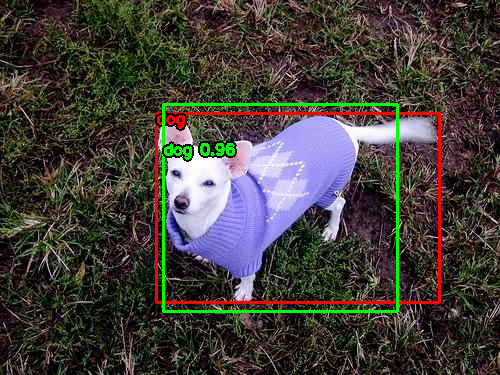
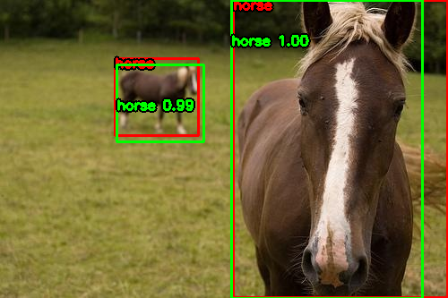

# Object Detector with DNN OpenCV
<div style="display: flex; flex-wrap: wrap; justify-content: space-between;">
  <!-- First row -->
  <div style="width: 24%; margin-bottom: 10px; text-align: center;">
    
  </div>
  <div style="width: 24%; margin-bottom: 10px; text-align: center;">
    
  </div>
  <div style="width: 24%; margin-bottom: 10px; text-align: center;">
    
  </div>
  <div style="width: 24%; margin-bottom: 10px; text-align: center;">
    
  </div>

  <!-- Second row -->
  <div style="width: 24%; margin-bottom: 10px; text-align: center;">
    
  </div>
  <div style="width: 24%; margin-bottom: 10px; text-align: center;">
    
  </div>
  <div style="width: 24%; margin-bottom: 10px; text-align: center;">
    
  </div>
  <div style="width: 24%; margin-bottom: 10px; text-align: center;">
    
  </div>
</div>

This project implements an object detector using the OpenCV library and its DNN (Deep Neural Networks) module. The model used is a pre-trained *Mask R-CNN Inception V2* on the MS COCO dataset for object detection in images. The goal of this system is to identify objects of the classes "cat", "dog", "bird", and "horse" in custom or public images.

## Description

The project uses the *Mask R-CNN Inception V2* network, an architecture that not only detects objects but also provides segmentation for them. The model has been pre-trained on the MS COCO dataset, which contains over 200,000 labeled images of 80 object classes.

### Functionality

The code performs the following operations:
1. Loads a pre-trained Mask R-CNN model.
2. Runs inferences on a set of images to detect objects from the selected classes.
3. Saves the results in an output directory, displaying predictions on the images.
4. Calculates the mean Average Precision (mAP) at various Intersection over Union (IoU) thresholds to evaluate model performance.

### Requirements

- Python 3.x
- OpenCV
- Numpy
- Matplotlib
- tqdm

### Installation

To run this code, you first need to install the necessary dependencies:

```bash
pip install opencv-python numpy matplotlib tqdm
```

Additionally, you need the following files:

* A pre-trained model in TensorFlow format (frozen inference graph.pb).
* The corresponding configuration file (mask_rcnn_inception_v2_coco.pbtxt).
* A set of images to test the model.

# Usage
1. Clone this repository to your local machine.
2. Run the `detector.py` script with the following parameters:

```bash
python detector.py --model <path_to_model> --config <path_to_config> --labels_coco <path_to_labels> --images <path_to_images> --output <path_to_output> --th 0.5 --max_imgs 5 --plot
```

# Parameters
* **--model**: Path to the pre-trained model file.
* **--config**: Path to the configuration file.
* **--labels_coco**: Path to the file with COCO dataset labels.
* **--images**: Path to the images to be processed.
* **--output**: Path where the processed images will be saved.
* **--th**: Confidence threshold for detections (default is 0.5).
* **--max_imgs**: Maximum number of images to process per class (default is 5).
* **--plot**: If enabled, processed images will be shown.

# Results
The model's performance was evaluated using the Mean Average Precision (mAP) metric at various Intersection over Union (IoU) thresholds. The results showed that the model is highly accurate at low IoU thresholds, but accuracy decreases as the threshold increases.

The results of object predictions in the images include:

- Bounding boxes for each detected object.
- The object's class and its confidence level.